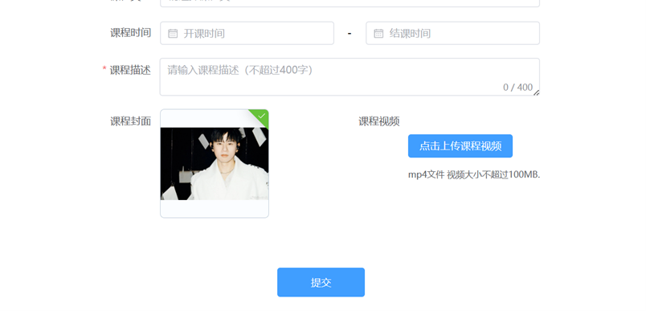
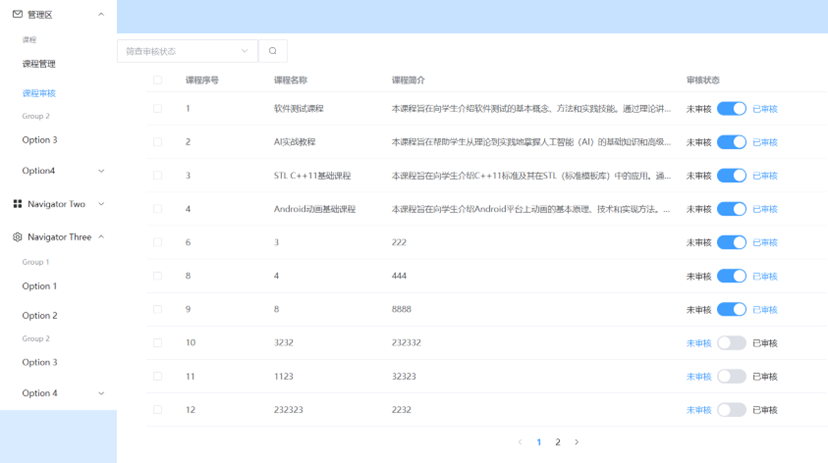
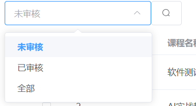

# 课程信息管理系统

本系统旨在管理在线课程的生命周期，涵盖了课程的添加、编辑、删除、浏览、搜索、导出、审核等功能。通过管理员和超级管理员角色的权限控制，实现高效的课程管理与审核流程。

## 技术栈

### 前端技术：
- **Vue 3**：用于构建用户界面，响应式开发。
- **TypeScript**：提高代码可维护性和开发效率，增加类型安全。
- **CSS**：用于页面布局和样式设计。
- **Vue Router**：用于页面的路由控制，支持组件间的导航。
- **Axios**：用于前后端的 HTTP 请求交互。

### 后端技术：
- **Spring Boot**：提供稳定的后台服务框架。
- **Mybatis**：用于与 MySQL 数据库的交互，实现持久化操作。
- **MySQL**：用于存储课程信息。

## 系统功能

### 1. 课程信息管理

#### 1.1 课程添加
管理员可以通过填写课程基本信息（课程名称、封面、简介、排序、视频、作者等）来添加新课程。点击“新增”按钮后，打开课程创建弹窗，填写完所有必填字段后，点击“确定”按钮提交。

#### 1.2 课程编辑
管理员可以编辑已存在的课程信息，包括课程名称、课程封面、课程简介、课程排序、课程视频、作者等。点击“修改”按钮后，进入编辑页面进行修改，提交修改后，课程信息将更新。

#### 1.3 课程删除
管理员可以删除课程，通过点击“删除”按钮，弹出确认框进行确认删除。支持单个或批量删除操作。

#### 1.4 课程浏览
超级管理员和租户管理员可以浏览所有课程的基本信息。

#### 1.5 课程搜索
管理员可以通过课程名称、排序等关键字进行模糊搜索，快速查找课程。

#### 1.6 课程详情
点击课程标题查看课程的详细内容，包括视频、名称、作者等详细信息。

#### 1.7 课程导出
管理员可以将课程列表导出为 Excel 文件，包含详细的课程信息。

### 2. 审核管理

#### 2.1 审核列表
超级管理员可以查看租户提交的课程发布审核列表。

#### 2.2 审核操作
超级管理员可以对课程进行审核操作，批准或拒绝课程发布。通过审核的课程将在前端小程序端显示，未通过审核的课程将显示审核状态，租户可进行修改后重新提交审核。

## 模块架构

### 前端部分
前端部分使用 Vue3 + TypeScript + CSS 进行开发，主要组件包括：

- **CourseManage.vue**：课程列表页，包含课程模糊搜索、课程列表加载、添加、删除、更新课程、导出课程、查看课程等功能。
- **addCourse.vue**：用于添加课程的组件。
- **updateCourse.vue**：用于更新课程信息的组件。
- **courseDetail.vue**：查看课程详情的组件。
- **courseCheck.vue**：超级管理员用来审核课程的组件。

前端与后端通过 axios 进行 HTTP 请求和数据交互，支持 GET 和 POST 方法。

### 后端部分
后端使用 Spring Boot + MyBatis + Java 开发，主要分为以下层次：

- **Entity层**：定义课程实体类，包括课程的所有属性，如课程名称、描述、视频等。
- **Controller层**：负责处理前端请求，调用相应的业务逻辑进行数据处理，返回结果给前端。
- **Biz层**：实现具体的业务逻辑，如课程的增删改查、课程审核等功能。
- **Mapper层**：定义 MyBatis Mapper 接口，进行数据库操作，如插入、更新、删除、查询课程信息等。

## 运行指南

### 1. 环境要求
- **Node.js**：用于运行前端项目。
- **Java 8 及以上**：用于运行后端 Spring Boot 项目。
- **MySQL 5.7 及以上**：用于存储课程数据。

### 2. 前端项目运行
1. 克隆前端代码库：

    ```bash
    git clone <前端项目地址>
    cd <前端项目目录>
    ```

2. 安装依赖：

    ```bash
    npm install
    ```

3. 启动开发服务器：

    ```bash
    npm run dev
    ```

    启动后，前端应用将在本地 `http://localhost:8080` 上运行。

### 3. 后端项目运行
1. 克隆后端代码库：

    ```bash
    git clone <后端项目地址>
    cd <后端项目目录>
    ```

2. 配置数据库连接：
   在 `application.properties` 文件中配置 MySQL 数据库连接：

    ```properties
    spring.datasource.url=jdbc:mysql://localhost:3306/your_database
    spring.datasource.username=your_username
    spring.datasource.password=your_password
    ```

3. 启动 Spring Boot 项目：

    ```bash
    ./mvnw spring-boot:run
    ```

    后端应用启动后，将会在 `http://localhost:8081` 上运行。

### 4. 数据库初始化
在数据库中创建课程相关的表格，可以通过运行 `src/main/resources/sql/init.sql` 文件来自动创建表结构。确保数据库连接配置正确后，初始化数据库。

### 5. 测试与调试
在运行后端和前端服务时，使用浏览器访问前端界面（`http://localhost:8080`）进行测试。可以通过不同的角色进行操作，例如管理员添加课程、修改课程信息，超级管理员审核课程等功能。

## 功能截图

### 1. 课程列表加载

在这个部分，用户通过登录即可进入到课程管理界面，此时，课程列表会被加载到表格中，以方便管理员直接对全部课程信息列表进行查看。


### 2. 添加课程


为了进行添加课程操作，管理员可以在加载出的课程管理界面中点击添加课程按钮，即可通过路由跳转到添加课程界面。


在添加课程信息界面，用户可以填写表单进行课程信息的创建。其中包括课程名称、作者、学分、学时、类型、开课时间与结课时间、课程描述、课程封面以及课程视频进行设置。填写好表单后，点击提交按钮即可成功提交。提交后，会有添加用户成功的提示弹框。

接下来，需要着重解释一下课程封面上传以及视频上传部分。

#### 课程封面上传



对于图片上传，点击上传组件即可弹出电脑文件查找框，选择合适的课程封面后，即可显示图片上传成功，并且可以在上传组件框中预览到图片的缩略图。


#### 视频上传


对于视频上传部分，可以点击上传课程视频按钮进行上传，并且只能提交 mp4 格式文件。首先尝试在上传视频接口上传图片，会提示错误信息“请上传视频文件”。选择上传视频文件后，会提示文件上传成功，并且能够看到上传的视频预览图，并且可以放大进行视频观看，同时也提供倍速调整、下载等功能。

### 3. 删除课程


对于删除课程功能，首先要选中需要被删除的课程，点击删除课程按钮。点击后会提示是否删除 1 个课程，点击确定即可将课程删除。


同时，课程删除也提供批量删除功能，可以同时勾选多个待删除课程信息，点击删除按钮即可将这些课程信息全部删除，同时也提示成功删除 n 门课程的信息。

### 4. 更新课程功能


对于更新课程功能，首先需要选中待更新课程，然后点击更新课程按钮，即可通过路由跳转到更新课程信息表单页面。在该页面可以直接看到表单各项填充了该课程相应信息，这样管理员可以在原信息基础上进行课程信息的修改。

提交修改信息后，即可跳转回课程管理界面，如图可以看到 22 号课程的课程信息被成功修改。

### 5. 导出课程功能


对于导出课程列表部分，只需点击导出课程按钮，在弹框中点击确认，即可自动导出 xlsx 格式的表格文件。同时，表格中的内容为课程的详细信息，而不是课程管理界面展示出的课程列表中的粗略信息。

### 6. 查看课程详情功能


对于查看课程详情部分，首先选中待查看课程，然后点击查看详情按钮，即可跳转到查看课程详细信息页面，点击返回按钮即可返回课程管理主界面。

### 7. 课程审核




课程审核部分只有超级管理员可以进行操作。

对于课程审核的查看课程审核情况部分，可以通过下拉框进行课程审核状态的筛选。


对于课程审核部分，超级管理员可以通过控制课程审核处的开关组件进行课程审核，课程列表中的课程状态也即时相应地进行修改。

## 结语

本系统提供了一个完整的在线课程管理方案，支持课程的全生命周期管理，包括创建、更新、删除、浏览、审核和导出等功能。通过清晰的权限分配和易于使用的界面，帮助管理员高效地管理课程，并确保课程内容的质量与合规性。
